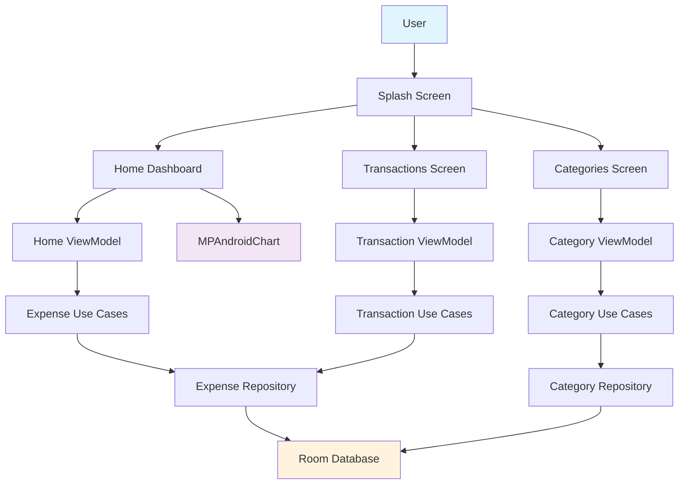

# ExpenseTracker 📱💰

An offline-first Android application for daily expense tracking and financial insights. Built with modern Android architecture and Material Design 3.

[](https://kotlinlang.org/)
[](https://developer.android.com/jetpack/compose)
[](https://developer.android.com/topic/architecture)
[](LICENSE)

## 🎯 Project Overview

ExpenseTracker is a simple, fast, and reliable expense tracking application that works completely offline. It provides users with intuitive expense management, category-based organization, and insightful spending visualization through interactive charts.

**Core Value Proposition**: Simple, fast, and reliable expense tracking that works offline with automated categorization and insightful spending visualization.

### Key Benefits
- ✅ **100% Offline** - Works without internet connection
- ⚡ **Fast Performance** - < 2 second launch, 60 FPS navigation
- 🎨 **Modern UI** - Material Design 3 with dark mode support
- 📊 **Visual Analytics** - Interactive charts and spending insights
- 🏗️ **Clean Architecture** - Maintainable and testable codebase

---

## ✨ Key Features

### 🏠 **Home Dashboard**
- Monthly and daily expense summaries
- Category-wise spending breakdown
- Interactive pie/donut chart visualization
- Highest spending category insights

### 💳 **Transaction Management**
- Quick expense entry with floating action button
- Comprehensive transaction list with search
- Advanced filtering by date, category, and amount
- Sorting options (newest/oldest, amount, category)

### 🏷️ **Category Management** 
- Create, edit, and delete expense categories
- Default categories: Food, Travel, Shopping, Bills, Health, Entertainment
- Category validation and duplicate prevention
- Safe deletion with transaction dependency checks

### 🎨 **User Experience**
- Splash screen with branded animation
- Bottom navigation with 3 main sections
- Material Design 3 theming
- Full dark mode support
- Accessibility features

---

## 📱 Screens / Modules Overview

### Main Navigation Structure
```
📱 ExpenseTracker App
├── 🚀 Splash Screen (Branding + Animation)
└── 📍 Bottom Navigation
    ├── 🏠 Home Tab (Dashboard & Analytics)
    ├── 💳 Transactions Tab (List & Management) 
    └── 🏷️ Categories Tab (Category CRUD)
```

### Feature Modules
- **Home**: Dashboard summaries, charts, and spending insights
- **Transactions**: Expense CRUD operations, filtering, and search
- **Categories**: Category management and validation
- **Core**: Shared UI components, database, and utilities

---

## 🛠️ Tech Stack

### **Frontend**
- **Kotlin** - Modern programming language for Android
- **Jetpack Compose** - Declarative UI toolkit
- **Material Design 3** - Google's design system
- **Compose Navigation** - Type-safe navigation

### **Architecture & Patterns**
- **MVVM + Clean Architecture** - Separation of concerns
- **Repository Pattern** - Data source abstraction
- **Use Cases** - Business logic encapsulation
- **StateFlow** - Reactive state management

### **Database & Storage**
- **Room Database** - SQLite abstraction with offline-first approach
- **Flow** - Reactive data streams
- **BigDecimal** - Precise financial calculations

### **Dependency Injection & Testing**
- **Hilt** - Dependency injection framework
- **JUnit** - Unit testing framework
- **Mockito** - Mocking for tests

### **Charts & Visualization**
- **MPAndroidChart** - Interactive chart library
- **Compose Integration** - Seamless chart embedding

---

## 🏗️ Architecture Summary

This project follows **Clean Architecture** principles with **MVVM pattern** for maintainable, testable, and scalable code.

### Architecture Layers
```
📱 UI Layer (Compose) 
    ↕️ 
🎯 Presentation Layer (ViewModels)
    ↕️ 
💼 Domain Layer (Use Cases) 
    ↕️ 
🗄️ Data Layer (Repositories + Room)
```

### Module Dependencies
```
feature → domain → core
```
- **feature modules** depend on **core modules**
- **No direct dependencies** between feature modules
- **Shared code** belongs in **core modules**

---

## 📊 System Architecture

### Component Interaction Flow


### Data Flow Architecture

```mermaid
flowchart LR
    A[User Action] --> B[Compose UI]
    B --> C[ViewModel]
    C --> D[Use Case]
    D --> E[Repository] 
    E --> F[DAO]
    F --> G[Room Database]
    
    G --> H[Flow/StateFlow]
    H --> I[Repository]
    I --> J[Use Case]
    J --> K[ViewModel]
    K --> L[UI State Update]
    L --> M[Compose Recomposition]
    
    style A fill:#e8f5e8
    style G fill:#fff3e0
    style M fill:#e1f5fe
```


---

## 📁 Project Structure

```
ExpenseTracker/
├── app/                                    # Main application module
│   ├── src/main/java/com/utility/expensetracker/
│   │   ├── MainActivity.kt                 # Single activity + navigation
│   │   ├── navigation/                     # Navigation graphs
│   │   ├── theme/                          # Material 3 theming
│   │   └── ExpenseTrackerApplication.kt    # Hilt application class
│   └── build.gradle.kts                    # App-level dependencies
│
├── feature/                                # Feature modules
│   ├── home/                               # Dashboard & analytics
│   │   ├── src/main/java/.../feature/home/
│   │   │   ├── presentation/               # ViewModels, UI states
│   │   │   ├── ui/                         # Composables, screens
│   │   │   └── di/                         # Hilt modules
│   │   └── build.gradle.kts
│   │
│   ├── transaction/                        # Expense management
│   │   ├── src/main/java/.../feature/transaction/
│   │   │   ├── presentation/               # Transaction ViewModels
│   │   │   ├── ui/                         # Transaction screens
│   │   │   └── di/                         # Feature DI modules  
│   │   └── build.gradle.kts
│   │
│   └── category/                           # Category management
│       ├── src/main/java/.../feature/category/
│       │   ├── presentation/               # Category ViewModels
│       │   ├── ui/                         # Category screens
│       │   └── di/                         # Category DI
│       └── build.gradle.kts
│
├── core/                                   # Shared modules
│   ├── ui/                                 # Shared UI components
│   │   ├── src/main/java/.../core/ui/
│   │   │   ├── components/                 # Reusable composables
│   │   │   ├── theme/                      # Material 3 theme
│   │   │   └── utils/                      # UI utilities
│   │   └── build.gradle.kts
│   │
│   ├── database/                           # Room database
│   │   ├── src/main/java/.../core/database/
│   │   │   ├── entities/                   # Room entities
│   │   │   ├── dao/                        # Data access objects
│   │   │   ├── migrations/                 # Database migrations
│   │   │   └── ExpenseDatabase.kt          # Database configuration
│   │   └── build.gradle.kts
│   │
│   ├── domain/                             # Business logic
│   │   ├── src/main/java/.../core/domain/
│   │   │   ├── model/                      # Domain models
│   │   │   ├── repository/                 # Repository interfaces
│   │   │   └── usecase/                    # Business use cases
│   │   └── build.gradle.kts
│   │
│   └── common/                             # Utilities & extensions
│       ├── src/main/java/.../core/common/
│       │   ├── utils/                      # Utility classes
│       │   ├── extensions/                 # Kotlin extensions
│       │   └── constants/                  # App constants
│       └── build.gradle.kts
│
├── gradle/                                 # Gradle configuration
│   └── libs.versions.toml                  # Version catalog
├── build.gradle.kts                        # Project-level build script
├── settings.gradle.kts                     # Module definitions
├── PRD_ExpenseTracker_v1.0.md             # Product Requirements Document
└── README.md                               # This file
```

---

## 🚀 Getting Started

### Prerequisites
- **Android Studio** Hedgehog | 2023.1.1 or later
- **JDK** 17 or later  
- **Android SDK** API 24+ (Android 7.0)
- **Kotlin** 1.9+

### Setup Instructions

1. **Clone the Repository**
   ```bash
   git clone https://github.com/yourusername/ExpenseTracker.git
   cd ExpenseTracker
   ```

2. **Open in Android Studio**
   - Launch Android Studio
   - Select "Open an existing project"
   - Navigate to the cloned directory and select it

3. **Sync Project**
   - Android Studio will automatically sync Gradle dependencies
   - Wait for the sync to complete

4. **Run the App**
   - Connect an Android device or start an emulator
   - Click the "Run" button or press `Ctrl+R` (Windows/Linux) / `Cmd+R` (Mac)

### Configuration
- **Minimum SDK**: API 24 (Android 7.0)
- **Target SDK**: API 34 (Android 14)
- **Compile SDK**: API 34

---

## 🔧 Build Commands

### Basic Commands
```bash
# Build debug APK
./gradlew assembleDebug

# Build release APK  
./gradlew assembleRelease

# Install debug APK on connected device
./gradlew installDebug

# Clean project
./gradlew clean
```

### Quality Assurance
```bash
# Run lint checks
./gradlew lint

# Run Kotlin lint checks
./gradlew ktlintCheck

# Auto-fix Kotlin lint issues
./gradlew ktlintFormat

# Generate lint reports
./gradlew lintDebug
```

### Build Variants
- **Debug**: Development build with debugging enabled
- **Release**: Production build with optimizations and obfuscation

---

## 🧪 Testing Commands

### Unit Tests
```bash
# Run all unit tests
./gradlew test

# Run unit tests for specific module
./gradlew :feature:home:test
./gradlew :core:database:test

# Run tests with coverage report
./gradlew testDebugUnitTestCoverage
```

### Instrumented Tests
```bash
# Run all instrumented tests
./gradlew connectedAndroidTest

# Run specific feature tests
./gradlew :feature:transaction:connectedAndroidTest
```

### Testing Strategy
- **ViewModels**: State management and business logic validation
- **Use Cases**: Business rule enforcement and edge case handling
- **Repositories**: Data source coordination and caching logic
- **DAOs**: Database operations and query correctness
- **UI Tests**: Critical user flows only (focused approach)

---

## 🗄️ Database Overview

### Room Database Schema

#### Core Entities
```kotlin
// Expense Entity - Financial transactions
@Entity(tableName = "expenses")
data class Expense(
    @PrimaryKey val id: String,
    val amount: Long,              // Amount in cents (avoids Double precision issues)
    val categoryId: String,        // Foreign key to Category
    val note: String?,             // Optional expense description
    val timestamp: Long,           // UTC milliseconds
    val createdAt: Long           // Audit timestamp
)

// Category Entity - Expense categorization  
@Entity(tableName = "categories")
data class Category(
    @PrimaryKey val id: String,
    val name: String,              // Category display name
    val iconResId: Int,            // Material icon resource ID
    val createdAt: Long           // Audit timestamp
)
```

#### Key Database Features
- **Offline-First**: All data stored locally in Room/SQLite
- **Indexing**: Optimized queries on frequently accessed columns (dates, categories)  
- **Migrations**: Safe schema evolution with data preservation
- **Validation**: Amount > 0, required categories, UTC timestamps
- **Precision**: Financial amounts stored as `Long` (cents) for accuracy

#### Default Categories
The app ships with these pre-configured categories:
- 🍽️ Food & Dining
- ✈️ Travel & Transport  
- 🛍️ Shopping & Retail
- 💡 Bills & Utilities
- 🏥 Health & Medical
- 🎬 Entertainment & Recreation

---

## 🗺️ Roadmap / Future Enhancements

### 📅 Phase 2: Enhanced Analytics (Q3 2026)
- 📈 Monthly/yearly spending trend analysis
- 🎯 Budget planning with smart alerts
- 🔮 AI-powered spending predictions and insights
- 📊 Custom reporting periods and export options

### 📅 Phase 3: Advanced Features (Q4 2026)
- 📸 Receipt photo capture with OCR text extraction
- 🔄 Recurring expense templates and automation
- 💱 Multi-currency support with real-time exchange rates
- ☁️ Cloud backup and cross-device synchronization

### 📅 Phase 4: Social & Integration (Q1 2027)
- 👥 Expense sharing with family/teams
- 🏦 Bank account integration (read-only for categorization)
- 📤 Export to popular accounting software (QuickBooks, etc.)
- 🏆 Spending challenges and gamification features

### 📅 Long-term Vision
- 🤖 Smart expense categorization using machine learning
- 📱 Wear OS companion app for quick expense logging
- 🌐 Web dashboard for comprehensive financial analysis
- 🔗 Integration with popular financial planning tools

---

## 🤝 Contributing

We welcome contributions to ExpenseTracker! Here's how you can help:

### Development Guidelines
- Follow **Clean Architecture** principles
- Maintain **MVVM pattern** consistency  
- Write **unit tests** for ViewModels and use cases
- Use **meaningful commit messages** (Conventional Commits)
- Follow **Kotlin coding conventions**
- Ensure **Material Design 3** compliance

### Code Standards
- **Kotlin first** - prefer Kotlin idioms and features
- **Immutable data** - use `data class` with `val` properties
- **Meaningful names** - clear, descriptive variable/function names
- **Function size** - keep functions under 50 lines where possible
- **String resources** - no hardcoded UI text
- **Dark mode** - ensure all UI supports dark theme

### Testing Requirements
- **Unit tests** required for new ViewModels and use cases
- **Repository mocking** - mock repositories, not external services  
- **Edge case coverage** - test boundary conditions and error scenarios
- **Integration tests** for critical user flows

### Pull Request Process
1. **Fork** the repository and create a feature branch
2. **Implement** your changes following the coding standards
3. **Write tests** for new functionality
4. **Run quality checks**: `./gradlew ktlintCheck lint test`
5. **Submit PR** with clear description and test coverage

### Architecture Validation
- ✅ UI layer doesn't call repositories directly
- ✅ Business logic stays in use cases
- ✅ Database access only through repositories
- ✅ Feature modules don't depend on each other
- ✅ Money handling uses BigDecimal/Long (never Double)

---

**Built with ❤️ using modern Android development practices**